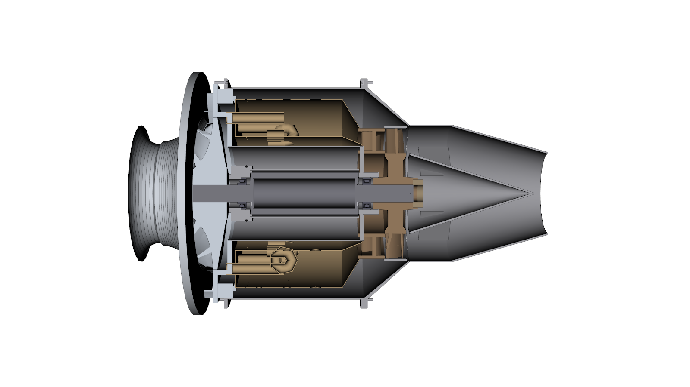

# jetsuite2 — micro-turbojet design suite (single-spool, centrifugal compressor)

Takes a thrust target (100–1000 N) and operating constraints through the standard
gas-turbine design sequence to a manufacturable CAD assembly, with sub-second
re-analysis when any input changes.

```
requirements -> cycle -> speed -> compressor -> turbine -> combustor
             -> layout -> rotor -> mechanical -> geometry -> cad
```

Every stage is a pure function of a declared slice of the design state; the
graph re-runs only the stages whose *input values* changed (hash of the
projected values, not of the file).  Full physics chain: **~0.4 s** on a laptop.
CAD: impeller ~10 s, everything else ~30 s, cached per part.



Render with `python tools/render.py designs/p500 iso.png section.png` (off-screen VTK).

## Install

```powershell
uv venv --python 3.12 .venv
$env:VIRTUAL_ENV="$PWD\.venv"; uv pip install -e . pytest
.venv\Scripts\jet --help
```

## Quick start

```powershell
jet new designs\p500 --thrust 500                 # create + run the whole chain
jet set -d designs\p500 compressor.material=Al2618-T61 --run   # change, see what re-ran
jet converge -d designs\p500                      # cycle efficiencies <- component estimates
jet rules -d designs\p500                          # every design-rule verdict with its source
jet inputs -d designs\p500 compressor              # inputs with documentation
jet cad -d designs\p500                            # STEP per part + coloured assembly (+ .glb)
jet report -d designs\p500                         # markdown design report
jet diff -d designs\p500 3                         # what changed since version 3
jet history -d designs\p500 ; jet checkout -d designs\p500 3
jet library bearings --bore 12 ; jet library materials
```

Set `$env:JET_DESIGN` (or run inside the design directory) to drop `-d`.

## What is in a design directory

```
design.json          inputs (by stage), outputs (by stage), stamps (hashes), rules
history/vNNNN.json   one full snapshot per version; log.txt says what changed
cad/parts/*.step     one STEP per part, always current
cad/engine_assembly.step / .glb
cad/cache/*.brep     per-part cache keyed on the geometry-sheet hash
cad/manifest.json    what was built from which hash; volumes, masses, validity
report.md
```

## Inputs and rules

`jet inputs` lists every input with its documentation; `auto` values are
derived by the stage (spool speed, blade counts, journal size, bearing choice,
stage loading, hole diameters …) and can be overridden with a number.

Rules (`jet rules --all`) enforce established practice at every stage:
inducer relative Mach, tip speed vs material, exducer root stress (sized to the
limit), throat choke margin, diffusion ratio, turbine loading, hub/tip ratio,
blade root and disc stress against creep/yield allowables, burst margin,
bearing DN and temperature, forward-whirl critical-speed separation, torque,
combustor loading/residence time, envelope limits.  Each verdict cites its
source and says what to change.  See `docs/design_rules.md`.

## Standard component library

`src/jetsuite2/library/data/*.json` — hybrid angular-contact and deep-groove
bearings (bore, OD, width, DN limit, temperature rating, load ratings),
DIN 471/472 retaining rings, ISO 4762 screws, KM locknuts, ISO 3601 O-rings,
glow-plug igniter, EGT probe, seal rules; `library/materials.py` — aluminium,
titanium, steels and nickel superalloys with yield/UTS/creep vs temperature.
Drop extra JSON catalogues into a directory named by `JETSUITE2_LIBRARY`.

## Verification

`pytest` (27 tests): gas model against reference cp values, enthalpy/entropy
consistency, choked mass-flow function, value-hash invalidation properties,
version diff/checkout, bearing selection, rotordynamics (closed-form beam,
gyroscopic branch splitting, Jeffcott critical), a 100–1000 N thrust sweep and
a regression against the boomsonic_v0 frozen 500 N design (airflow, impeller
radius, inducer radius, turbine pressure ratio within 3–5 %).

## Documents

* `docs/architecture.md` — modules, data contracts, invalidation, what was learned from v0 / jetsuite.
* `docs/kernel_evaluation.md` — CadQuery/OCCT vs PicoGK, with measurements.
* `docs/design_rules.md` — every rule, its limit and its source.
* `CLAUDE.md` — how to operate the suite from Claude Code.
