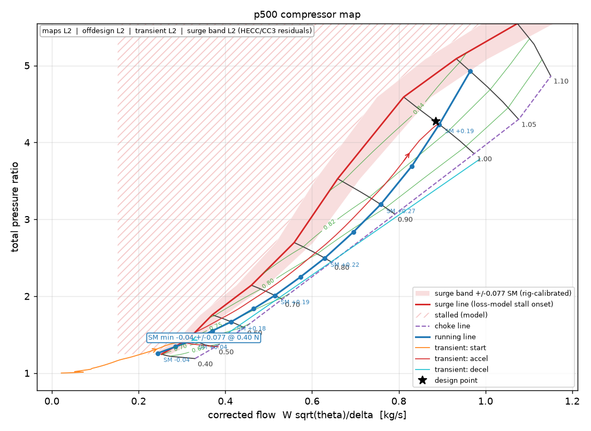
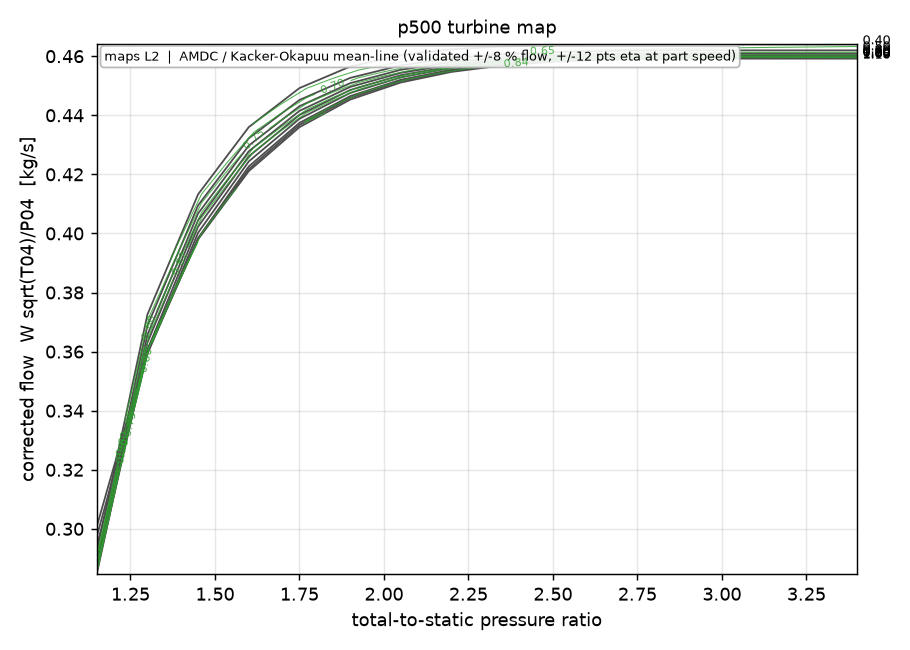
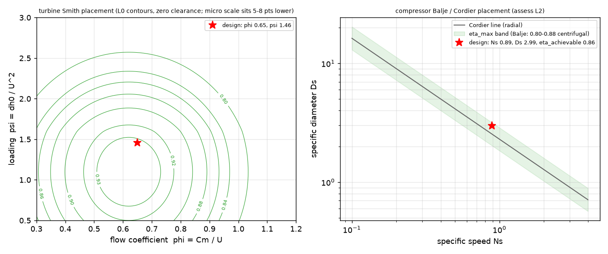
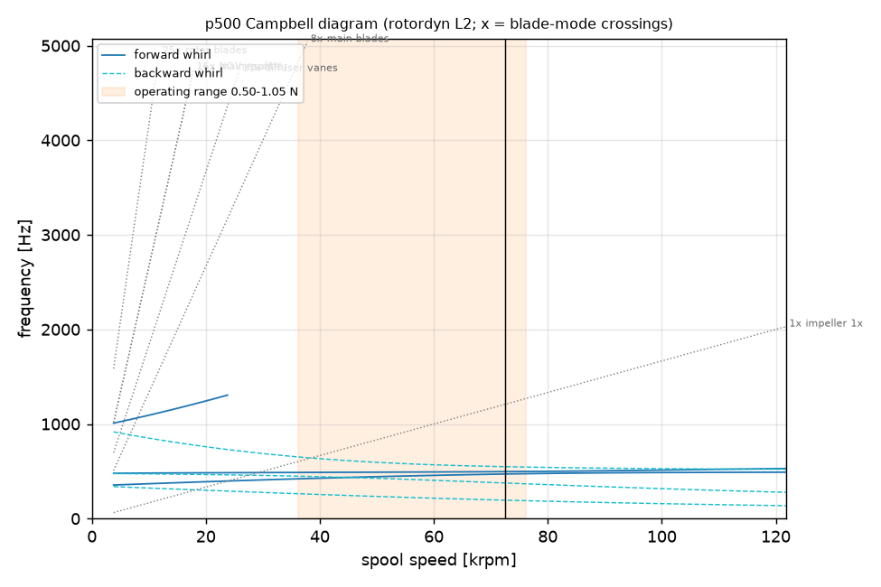

# p500 - design report (v43)

Overall rule verdict: **fail**. Fidelity tier of every claim is listed per stage at the end; L1 = correlation / mean-line sizing, L2 = mean-line loss models and FE beam rotordynamics, L3 = ingested solver or test results.

## Requirements and cycle

| item | value |
|---|---|
| thrust | 500 N at 0 m, M 0 |
| OPR / T04 | 4 / 1150 K |
| airflow / fuel flow | 0.8674 kg/s / 0.01655 kg/s |
| TSFC | 0.1192 kg/(N h) |
| Tt3 / Tt5 | 461.1 / 1003 K |
| turbine PR / NPR | 1.928 / 1.893 (choked) |
| efficiencies assumed (c / t) | 0.8046 / 0.8733 |
| efficiencies estimated L1 (c / t) | 0.8069 / 0.8751 |
| efficiencies L2 loss model (c / t) | 0.8303 / 0.8373 |
| L2 design-point PR / surge margin | 4.271 / 0.1726 (diffuser) |

## Spool speed

7.25e+04 rpm (auto (binding: turbine_disc)); limits: inducer 81563, turbine AN2 85202, turbine disc 74937, bearing DN 80952 rpm

## Compressor

| item | value |
|---|---|
| material | Ti-6Al-4V |
| inducer r1h / r1s | 14.71 / 42.02 mm, M1rel 1.095 |
| impeller D2 / b2 / L | 131.4 / 7.694 / 42.05 mm |
| U2 / backsweep / blades | 498.8 m/s / 30 deg / 8+8 |
| slip / work coefficient | 0.8438 / 0.6821 |
| exducer root / tip thickness | 1.772 / 0.657 mm |
| diffuser | vaned, r3/r2 1.08, r4 90.66 mm, 11 vanes, throat M 0.7 |
| choke margin | 0.486 |

### Component quality assessment

Scores (1 = inside the target band): compressor 0.85, diffuser 1, turbine 0.98. Balje: Ns 0.8886, Ds 2.994, achievable efficiency ~0.856. Slip factors: wiesner 0.844, stanitz 0.816, stodola 0.787, busemann 0.841.

| id | item | value | target | score | consequence |
|---|---|---|---|---|---|
| AQ-C1 | specific speed Ns (Balje, dimensionless) | 0.8886  | 0.5 .. 0.9 | 1 | outside the radial-stage sweet spot the achievable efficiency falls; low Ns = narrow exit, high Ns = mixed-flow territory |
| AQ-C2 | specific diameter Ds | 2.994  | 3.5 .. 5.5 | 0.75 | Cordier line: Ns*Ds ~ 2-2.5 for radial compressors |
| AQ-C3 | Ns*Ds (Cordier) | 2.66  | 1.8 .. 2.8 | 1 | off the Cordier line the impeller is over- or under-sized for its duty |
| AQ-C4 | L1 efficiency estimate vs Balje achievable band | -0.04929  | -0.04 .. 0.02 | 0.85 | achievable ~0.856 at this Ns; a higher claim needs justification, a lower one leaves performance on the table |
| AQ-C5 | slip factor disagreement between methods (max-min) | 0.05634  | 0 .. 0.03 | 0.12 | each 0.01 of slip is ~1 % of work: a 3 % spread is a 3 % pressure-ratio uncertainty until CFD/test settles it |
| AQ-C6 | de Haller number W2/W1rms | 0.6486  | 0.65 .. 0.85 | 0.99 | below ~0.65 the inducer-to-exit deceleration separates the suction surface |
| AQ-C7 | diffusion ratio W1s/W2 | 1.717  | 1.4 .. 1.9 | 1 | above ~1.9 the shroud-side flow stalls (Dixon); below 1.4 the impeller is lightly loaded (heavy) |
| AQ-C8 | Coppage diffusion factor D_f | 0.574  | 0.35 .. 0.62 | 1 | blade-to-blade loading: above 0.6 the blade-loading loss and wake grow rapidly |
| AQ-C9 | work coefficient psi = dh/U2^2 (Euler) | 0.6821  | 0.55 .. 0.72 | 1 | high psi = radial blades and wide operating-range penalty; low psi = tip speed used inefficiently |
| AQ-C10 | inducer shroud relative Mach | 1.095  | 0.9 .. 1.25 | 1 | above ~1.25 shock losses and choke margin erode; below 0.9 the inducer is larger than it needs to be |
| AQ-C11 | exit width ratio b2/D2 | 0.05856  | 0.04 .. 0.09 | 1 | narrow exits lose efficiency to clearance and friction; wide exits promote exit-flow separation |
| AQ-C12 | inducer incidence range along the running line (max - min) | 14.21 deg | 0 .. 10 | 0.58 | a wide incidence swing means the inlet metal angle cannot suit both idle and max power |
| AQ-C13 | vaned-diffuser incidence at the lowest converged speed | -8.467 deg | -6 .. 5 | 0.78 | large positive incidence at low speed = diffuser stall = low-speed surge |
| AQ-D1 | vaneless gap r3/r2 | 1.08  | 1.05 .. 1.15 | 1 | too small: impeller/vane interaction, noise, forced response; too large: friction loss |
| AQ-D2 | vane throat / (pitch cos alpha3) at design | 1.013  | 0.95 .. 1.15 | 1 | a throat smaller than the free-stream opening chokes; much larger means the vane LE is not aligned with the flow |
| AQ-D3 | vane leading-edge incidence at design (L2 swirl) | -3.082 deg | -4 .. 2 | 1 | positive incidence eats the stall margin, negative the choke margin |
| AQ-D4 | diffuser inlet Mach (vaneless exit) | -  | 0.5 .. 0.95 | - | transonic vane inlets are loss- and range-sensitive |
| AQ-D5 | vaneless-space swirl angle alpha3 | 72.52 deg | 60 .. 74 | 1 | above ~75-78 deg the vaneless space itself stalls (Senoo); below 60 the impeller exit is heavily blocked |
| AQ-D6 | two-zone exit mixing loss / impeller exit dynamic head | 0.004038  | 0 .. 0.03 | 1 | wake/jet mixing before the vanes; grows with wake fraction (loading, clearance, low Re) |
| AQ-T1 | Smith-chart placement: efficiency contour at (psi, phi) | 0.9394  | 0.9 .. 0.96 | 1 | loading/flow coefficient combination away from the 0.9+ island costs stage efficiency directly |
| AQ-T2 | stage loading psi | 1.46  | 1.3 .. 2 | 1 | above 2 the rotor turning and losses grow; below 1.3 the annulus is short |
| AQ-T3 | flow coefficient phi | 0.65  | 0.5 .. 0.8 | 1 | outside 0.5-0.8 the velocity triangles skew and secondary losses rise |
| AQ-T4 | rotor Zweifel coefficient (actual) | 0.8376  | 0.75 .. 1.05 | 1 | too many blades = friction/blockage; too few = separation on the suction side |
| AQ-T5 | NGV Zweifel coefficient (actual) | 0.8547  | 0.75 .. 1.05 | 1 | as above for the nozzle row |
| AQ-T6 | hub reaction (free vortex) | -0.0241  | 0.05 .. 0.5 | 0.84 | negative hub reaction = hub-section diffusion in the rotor = separation |
| AQ-T7 | exit swirl |alpha3| | 11.31 deg | 0 .. 20 | 1 | exit swirl is lost kinetic energy in the jet pipe and loads the tail cone |
| AQ-T8 | rotor trailing-edge blockage t_te/o | 0.105  | 0 .. 0.1 | 0.95 | thick trailing edges on small blades: mixing loss ~ 0.5 (t/o) of the exit head |
| AQ-T9 | rotor-exit Mach | 0.376  | 0.25 .. 0.55 | 1 | high exit Mach wastes turbine work in the jet pipe; the nozzle then dominates the running line |
| AQ-T10 | nozzle throat / turbine exit annulus area | 0.6112  | 0.45 .. 0.85 | 1 | small ratio = high turbine exit Mach and a running line pushed toward surge; large = unchoked nozzle, thrust-lapse sensitive |
| AQ-T11 | rotor hub/tip ratio | 0.62  | 0.58 .. 0.85 | 1 | long blades: stress and tip-clearance sensitivity; short: clearance losses |

Backsweep trade (sizing chain + L2 speed line at the design speed):

| backsweep | U2 m/s | r2 mm | t_root mm | eta L1 | eta L2 | SM | choke margin | W1s/W2 |
|---|---|---|---|---|---|---|---|---|
| 10 | 458.3 | 60.36 | 1.07 | 0.806 | 0.813 | 0.235 | 0.481 | 2.33 |
| 15 | 465.3 | 61.29 | 1.35 | 0.809 | 0.817 | 0.148 | 0.48 | 2.2 |
| 20 | 476.2 | 62.73 | 1.54 | 0.81 | 0.822 | 0.149 | 0.483 | 2.02 |
| 25 | 484.7 | 63.85 | 1.71 | 0.809 | 0.825 | 0.154 | 0.483 | 1.9 |
| 30 | 498.8 | 65.7 | 1.77 | 0.807 | 0.83 | 0.16 | 0.486 | 1.72 |
| 35 | 510.2 | 67.2 | 1.85 | 0.802 | 0.832 | 0.17 | 0.485 | 1.59 |
| 40 | 530.2 | 69.83 | 1.8 | 0.796 | 0.836 | 0.187 | 0.488 | 1.41 |
| 45 | 548.1 | 72.19 | 1.78 | 0.781 | 0.835 | 0.0877 | 0.487 | 1.28 |

## Turbine

| item | value |
|---|---|
| material (rotor / NGV) | IN713LC / IN713LC |
| psi / phi / reaction | 1.46 / 0.65 / 0.4 |
| mean radius / heights | 45.61 mm; NGV 16.54 mm, rotor 21.4 mm |
| tip diameter / hub-tip | 112.6 mm / 0.62 |
| counts NGV / rotor | 16 / 25 |
| root stress at MCS / allowable | 297.8 / 436 MPa |

## Combustor

Annular, Ro 89.66 mm, Ri 41.21 mm, liner 92.25 mm long, U_ref 14.36 m/s, residence 2.5 ms, 14 vaporisers, igniter glow-1/4-32.

1-D network (L2): primary: phi 1.20, T 2352 K, residence 1.18 ms, Da 25; secondary: phi 0.49, T 1623 K, residence 0.56 ms, Da 0; dilution: phi 0.28, T 1190 K, residence 0.63 ms, Da 0. 
Combustion efficiency 0.985, LBO margin design 2.402 / idle 1.209, pattern factor 0.27 (NGV peak 1336 K), liner wall 978 K, altitude relight index 1.103. pattern factor, blow-out and wall temperature: +/-30 % model-form uncertainty (Lefebvre correlations)

## Rotor

Bearings 71902C-HC (DN 1.14e+06 at MCS), journal 15 mm, tube 36 x 25.92 mm, span 108.1 mm. Forward criticals: 23844, 29174 rpm (rigid-body: 23844, 29174); first bending above scan ceiling 190312 rpm.

Rotordynamics campaign (L2): max synchronous amplitude at G2.5 1.32 um, AF 3.31; exducer f1 1.931e+04 Hz, turbine blade f1 6519 Hz; resonance crossings in range: 0.

## Off-design and envelope (L2 maps)

Running line at the design condition: idle at N 0.4 (31.1 N), minimum surge margin -0.0439 at N 0.4, max point 493.6 N at T04 1150 K (T04-limited).

| N/N_d | thrust N | TSFC | T04 K | EGT K | SM | PR_c |
|---|---|---|---|---|---|---|
| 0.40 | 31 | 0.301 | 743 | 718 | -0.044 | 1.26 |
| 0.45 | 42 | 0.261 | 755 | 723 | +0.005 | 1.34 |
| 0.50 | 54 | 0.227 | 750 | 711 | +0.043 | 1.43 |
| 0.55 | 70 | 0.202 | 765 | 717 | +0.116 | 1.55 |
| 0.60 | 86 | 0.180 | 766 | 710 | +0.179 | 1.67 |
| 0.65 | 110 | 0.163 | 787 | 720 | +0.190 | 1.84 |
| 0.70 | 134 | 0.150 | 800 | 724 | +0.191 | 2.01 |
| 0.75 | 169 | 0.139 | 831 | 743 | +0.210 | 2.25 |
| 0.80 | 207 | 0.130 | 861 | 762 | +0.217 | 2.50 |
| 0.85 | 262 | 0.124 | 913 | 801 | +0.254 | 2.84 |
| 0.90 | 323 | 0.120 | 968 | 845 | +0.271 | 3.19 |
| 0.95 | 415 | 0.119 | 1064 | 927 | +0.242 | 3.69 |
| 1.00 | 524 | 0.120 | 1183 | 1034 | +0.194 | 4.23 |
| 1.05 | 664 | 0.125 | 1334 | 1173 | +0.069 | 4.93 |

Envelope: 69/96 grid points cleared (SM >= floor), worst SM -0.04617 at 9000.0 m / M 0.6 / dT -20.0 K; SLS max thrust 493.6 N.

| alt m | M | dT K | thrust N | TSFC | N/N_d | T04 K | SM | limit |
|---|---|---|---|---|---|---|---|---|
| 0 | 0.0 | 0.0 | 494 | 0.120 | 0.99 | 1150 | +0.207 | T04 |
| 1500 | 0.0 | 0.0 | 442 | 0.118 | 0.99 | 1150 | +0.188 | T04 |
| 3000 | 0.0 | 0.0 | 392 | 0.116 | 0.98 | 1150 | +0.151 | T04 |
| 5000 | 0.0 | 0.0 | 332 | 0.114 | 0.98 | 1150 | +0.101 | T04 |
| 7000 | 0.0 | 0.0 | 278 | 0.112 | 0.97 | 1150 | +0.047 | T04 |
| 9000 | 0.0 | 0.0 | 229 | 0.110 | 0.97 | 1150 | -0.012 | T04 |
| 0 | 0.3 | 0.0 | 439 | 0.140 | 0.99 | 1150 | +0.215 | T04 |
| 1500 | 0.3 | 0.0 | 395 | 0.136 | 0.99 | 1150 | +0.200 | T04 |
| 3000 | 0.3 | 0.0 | 353 | 0.133 | 0.98 | 1150 | +0.169 | T04 |
| 5000 | 0.3 | 0.0 | 301 | 0.130 | 0.98 | 1150 | +0.119 | T04 |
| 7000 | 0.3 | 0.0 | 254 | 0.127 | 0.97 | 1150 | +0.067 | T04 |
| 9000 | 0.3 | 0.0 | 211 | 0.124 | 0.97 | 1150 | +0.006 | T04 |
| 0 | 0.6 | 0.0 | 598 | 0.154 | 1.05 | 1314 | +0.153 | N_max (low-speed bracket unconverged) |
| 1500 | 0.6 | 0.0 | 545 | 0.151 | 1.05 | 1325 | +0.109 | N_max (low-speed bracket unconverged) |
| 3000 | 0.6 | 0.0 | 492 | 0.149 | 1.05 | 1335 | +0.068 | N_max (low-speed bracket unconverged) |
| 5000 | 0.6 | 0.0 | 429 | 0.146 | 1.05 | 1354 | -0.003 | N_max (low-speed bracket unconverged) |
| 7000 | 0.6 | 0.0 | 259 | 0.138 | 0.98 | 1150 | +0.119 | T04 |
| 9000 | 0.6 | 0.0 | 216 | 0.134 | 0.97 | 1150 | +0.064 | T04 |
| 0 | 0.8 | 0.0 | 623 | 0.160 | 1.05 | 1303 | +0.201 | N_max (low-speed bracket unconverged) |
| 1500 | 0.8 | 0.0 | 564 | 0.157 | 1.05 | 1309 | +0.174 | N_max (low-speed bracket unconverged) |
| 3000 | 0.8 | 0.0 | 513 | 0.154 | 1.05 | 1321 | +0.128 | N_max (low-speed bracket unconverged) |
| 5000 | 0.8 | 0.0 | 445 | 0.151 | 1.05 | 1334 | +0.070 | N_max (low-speed bracket unconverged) |
| 7000 | 0.8 | 0.0 | 384 | 0.148 | 1.05 | 1355 | -0.005 | N_max (low-speed bracket unconverged) |
| 9000 | 0.8 | 0.0 | 230 | 0.140 | 0.98 | 1150 | +0.115 | T04 |

## Transients (L2)

* **start**: light_off_s 3.45, self_sustain_s 13.35, idle_capture_s 17.2, T04_peak 1125, EGT_peak 1103, final_N_frac 0.4984, ok True
* **accel**: t_95pct_s 7.2, SM_min -0.0381, T04_peak 1200, Fn_final 523.6, SM_min_N_frac 0.5015, SM_min_band {'total': 0.08221083837632723, 'terms': {'rig (HECC/CC3 residuals, derived)': 0.0765416353793058, 'transient quasi-steady model form (declared)': 0.03}, 'dominant': 'rig (HECC/CC3 residuals, derived)', 'rule': 'RSS'}, ok True
* **decel**: t_to_idle_s 0.8, Wf_min 0.0007167, T04_min 487.7, ok True
* **hot_start**: T04_peak 1200, over_limit False
* **hung_start**: final_N_frac 0.09415, self_sustain_s -, hung True
* **overspeed**: N_peak_frac 0.97, T04_peak 1002, time_to_105pct_s -
* **flameout**: windmill_N_frac 0.02376, decay_to_light_off_s 6.4, relight_possible_at_M False, flight_mach 0

## Life (L1, factor-of-3 scatter applied in the verdicts)

Creep: blade 3.35e+06 h, disc rim 2.28e+05 h over the mission. LCF: impeller bore 1.03e+03 cycles, turbine bore 42.6 cycles (start thermal dT 342 K). Bearing L10 320 h (oil-mist). Containment: fragment 1.15e+04 J vs casing 1 mm (needs 7.3 mm).

## Manufacturability (L1)

Tip clearance stack-up: impeller worst case 0.17 mm (RSS 0.074) against 0.26 mm nominal; turbine 0.24 / 0.25 mm. Balance G2.5: 0.306 g mm per plane. Impeller (billet-5axis): min passage 12.3 mm, wrap 70.7 deg; flags: none. BOM 20 lines, ~6337 EUR, lead 10 weeks.

## Surge margins with their uncertainty bands

Every surge-margin verdict is shown as value, band and the arithmetic of the with-band check.  Terms combine by root-sum-square (independent error sources: a rig-fit residual, model-form extrapolations, a dynamics simplification); the dominant term names the datum that would shrink the band.  Declared terms are labelled; only the rig term is derived.

| rule | value | band | terms | value - band | limit | nominal | with band | tier |
|---|---|---|---|---|---|---|---|---|
| MAP-1 design-point surge margin (loss-model map, SAE definition) | +0.173 | +/-0.077 (RSS) | rig 0.077 | +0.096 | 0.150 | pass | FAIL | L2 |
| OD-1 minimum surge margin along the running line | -0.044 | +/-0.077 (RSS) | rig 0.077 | -0.120 | 0.100 | FAIL | FAIL | L2 |
| OD-4 idle surge margin | -0.044 | +/-0.077 (RSS) | rig 0.077 | -0.120 | 0.080 | FAIL | FAIL | L2 |
| ENV-2 worst-case surge margin over the envelope | -0.046 | +/-0.077 (RSS) | rig 0.077 | -0.123 | 0.080 | FAIL | FAIL | L2 |
| TRN-4 minimum surge margin during the slam acceleration | -0.038 | +/-0.082 (RSS) | rig 0.077; transient quasi-steady model form 0.030 (declared) | -0.120 | 0.050 | FAIL | FAIL | L2 |

## Maps and plots

Schedules in force: none (fixed geometry); surge band +/-0.077 SM points (rig-calibrated, see docs/validation.md).  Interactive map: `analysis/plots/compressor_map.html`.









## Envelope and mass

OD 183.3 mm x length 350.3 mm; estimated dry mass 6.44 kg.

| part | material | mass kg |
|---|---|---|
| impeller | Ti-6Al-4V | 0.854 |
| inlet_shroud | Al6061-T6 | 0.186 |
| diffuser | Al2618-T61 | 0.286 |
| outer_casing | AISI321 | 0.770 |
| combustor_liners | IN625 | 0.652 |
| inner_casing | AISI321 | 0.223 |
| ngv_ring | IN713LC | 0.378 |
| turbine_wheel | IN713LC | 0.707 |
| turbine_shroud | AISI321 | 0.111 |
| shaft | AISI4340 | 0.498 |
| bearings | steel/ceramic | 0.028 |
| housings_tunnel | AISI321 | 0.884 |
| nozzle_tailcone | AISI321 | 0.453 |

## Open risks and unresolved items

* [L1] **MECH-1** impeller disc peak stress at MCS vs yield: 738.5 vs 617 MPa -> fail. lower U2 (OPR/backsweep), boreless mount, or a stronger material
* [L1] **MECH-5** turbine disc peak stress vs bore allowable: 967.1 vs 630.8 MPa -> fail. thicker web/hub, lower rpm
* [L2] **TF-2** suction-side deceleration ratio W_ss,max / W_ss,exit (worst streamline): 1.933 vs 1.6  -> fail. hub 1.67, mid 1.59, shroud 1.93; unload the inducer (more incidence margin, smoother beta(m))
* [L2] **TF-5** blade loading parameter (W_ss - W_ps) / W_mean, max: 1.963 vs 0.9  -> warn. 
* [L2] **C1D-5** lean blow-out margin at idle: 1.209 vs 1.2  -> warn. raise idle speed or the deceleration fuel floor
* [L2] **MAP-1** design-point surge margin (loss-model map, SAE definition): 0.1726 vs 0.15  -> warn. more backsweep, larger vaneless gap, fewer / lower-solidity diffuser vanes, or a lower running line
* [L2] **MAP-6** compressor loss-model PR at design vs cycle OPR |diff|/OPR: 0.06767 vs 0.06  -> warn. loss model PR 4.271 vs cycle OPR 4.000
* [L2] **OD-1** minimum surge margin along the running line: -0.04394 vs 0.1  -> fail. lower the running line (larger nozzle), more backsweep, or a bleed / variable geometry
* [L2] **OD-2** max-thrust point recovers the design thrust: 0.9872 vs 0.95  -> warn. max thrust 494 N vs design 500 N (T04-limited)
* [L2] **OD-4** idle surge margin: -0.04394 vs 0.08  -> warn. 
* [L2] **ENV-1** fraction of envelope grid points cleared (converged, SM >= floor): 0.7188 vs 0.9  -> warn. see the envelope table for the failing corners
* [L2] **ENV-2** worst-case surge margin over the envelope: -0.04617 vs 0.08  -> fail. hot-day / high-Mach corners load the compressor: consider a variable nozzle or bleed
* [L2] **ENV-3** sea-level static max thrust vs design thrust: 0.9872 vs 0.95  -> warn. 
* [L2] **TRN-2** start light-off to self-sustain time: 9.9 vs 8 s -> warn. 
* [L2] **TRN-3** slam acceleration idle -> 95 % time: 7.2 vs 6 s -> warn. raise the accel limiter (watch SM)
* [L2] **TRN-4** minimum surge margin during the slam acceleration: -0.0381 vs 0.05  -> fail. lower accel_limit or add bleed
* [L2] **TRN-8** hung start with half starter torque avoided: 0 vs 1  -> warn. starter torque margin is thin
* [L1] **THM-8** mechanical-stage rim temperature assumption vs prediction |dT|: 89.67 vs 40 K -> warn. set mechanical.turbine_disc_rim_T_K=1040 mechanical.turbine_disc_bore_T_K=791 to carry the prediction into the stress rules
* [L1] **LIFE-3** impeller bore LCF cycles / scatter: 343.3 vs 500  -> fail. lower bore stress: boreless hub or lower U2
* [L1] **LIFE-4** turbine bore LCF cycles incl. start thermal stress / scatter: 14.19 vs 500  -> fail. slower start, thicker hub, or boreless wheel
* [L1] **LIFE-7** casing wall vs containment thickness (1/3 disc fragment at burst): 1 vs 7.262 mm -> warn. a containment ring around the turbine plane is the usual answer
* [L1] **MFG-2** turbine tip clearance remaining at worst-case stack-up: 0.01 vs 0.05 mm -> fail. 
* [L1] **MFG-6** impeller blade wrap / pitch (axial-view overlap): 1.572 vs 1.6  -> warn. 
* Surge line: predicted by stall indicators with +/-30 % uncertainty on the margin; no validated vaned-diffuser stall method exists at this fidelity.
* Efficiency correlations, stress concentration factors and life constants are conceptual-level; the UQ study quantifies their effect.

## Fidelity tiers

| stage | kind | tier | last run | overrides (ingested) |
|---|---|---|---|---|
| requirements | core | L0 | 2026-09-17T00:32:06 | - |
| cycle | core | L1 | 2026-09-17T00:32:06 | - |
| speed | core | L1 | 2026-09-17T00:32:06 | - |
| compressor | core | L1 | 2026-09-17T00:32:06 | - |
| turbine | core | L1 | 2026-09-17T00:32:06 | - |
| combustor | core | L1 | 2026-09-17T00:32:06 | - |
| layout | core | L0 | 2026-09-17T00:32:06 | - |
| rotor | core | L2 | 2026-09-17T00:32:07 | - |
| mechanical | core | L1 | 2026-09-17T00:32:07 | turbine.sigma_peak_Pa [L3], turbine.sigma_avg_Pa [L3], impeller.sigma_peak_Pa [L3] |
| control | core | L1 | 2026-09-17T00:32:07 | - |
| geometry | core | L0 | 2026-09-17T00:32:07 | - |
| maps | analysis | L2 | 2026-09-17T09:26:30 | - |
| offdesign | analysis | L2 | 2026-09-17T09:26:57 | - |
| assess | analysis | L2 | 2026-09-17T09:28:01 | - |
| throughflow | analysis | L2 | 2026-09-17T09:26:30 | - |
| combustor1d | analysis | L2 | 2026-09-17T09:28:01 | - |
| envelope | analysis | L2 | 2026-09-17T09:26:57 | - |
| transient | analysis | L2 | 2026-09-17T09:28:01 | - |
| thermal | analysis | L1 | 2026-09-17T09:26:30 | - |
| life | analysis | L1 | 2026-09-17T09:26:57 | sigma_bore_total_Pa [L3] |
| rotordyn | analysis | L2 | 2026-09-17T09:26:30 | - |
| manufacturing | analysis | L1 | 2026-09-17T09:26:30 | - |
| testbench | analysis | L2 | 2026-09-17T09:28:01 | - |

## Design rules

```
[requirements]
  ok   REQ-1      thrust target inside supported range              500.0 <= 1000.0     N        +50.0 %  [brief: 100-1000 N]
  ok   REQ-2      thrust target above minimum                       500.0 >= 100.0      N       +400.0 %  [brief: 100-1000 N]
  ok   REQ-3      design Mach subsonic (pitot intake model)             0 <= 1.000              +100.0 %  [intake model: normal shock + duct]
[cycle]
  ok   CYC-1      OPR within single-stage centrifugal practice      4.000 <= 5.000               +20.0 %  [Dixon & Hall ch.7; micro-turbojet fleet 2.5-4.5]
  ok   CYC-2      OPR above useful minimum                          4.000 >= 2.200               +81.8 %  [cycle: specific thrust collapses below ~2.2]
  ok   CYC-3      T04 within uncooled cast-wheel practice          1150.0 <= 1250.0               +8.0 %  [IN-713LC/MAR-M247 uncooled rotor practice (JetCat/AMT class 1050-1200 K)]
  ok   CYC-4      T04 above combustor stability floor              1150.0 >= 950.0               +21.1 %  [lean stability at idle/design]
  info CYC-5      compressor exit temperature vs aluminium impeller limit (info)      461.1    -          K                 [materials.T_max]
  info CYC-6      nozzle pressure ratio                             1.893    -          -                 [-]
  ok   CYC-7      fuel-air ratio below 60 % stoichiometric          0.019 <= 0.041               +53.0 %  [combustor: overall phi < 0.6]
[speed]
  ok   SPD-1      inducer shroud relative Mach at design            1.095 <= 1.300               +15.8 %  [fielded micro-turbojet band 1.10-1.33 (boomsonic_v0 A3R.1)]
  ok   SPD-2      design rpm vs turbine AN2 limit                 72500.0 <= 85201.8    rpm      +14.9 %  [AN2 with IN713LC allowable 436 MPa at 1030 K, margin 1.25]
  ok   SPD-2b     design rpm vs turbine disc bore-stress limit    72500.0 <= 74937.1    rpm       +3.3 %  [bored IN713LC wheel, allowable 631 MPa at 750 K, k_peak 1.3]
  ok   SPD-3      design rpm vs bearing DN limit                  72500.0 <= 80952.4    rpm      +10.4 %  [bearing 71902C-HC DN 1.5e+06 x 0.85]
  info SPD-4      impeller tip speed allowed by material (info: set by work, see COMP-3)      454.1    -          m/s               [Ti-6Al-4V yield at Tt3]
[compressor]
  ok   COMP-1     inducer shroud relative Mach                      1.095 <= 1.300               +15.8 %  [fielded micro-turbojet band (boomsonic A3R.1)]
  ok   COMP-2     impeller tip speed U2                             498.8 <= 620.0      m/s      +19.5 %  [Ti impellers ~550-600 m/s, Al ~450-500 (Dixon; Rodgers)]
  ok   COMP-3     exducer root stress at MCS vs allowable (root sized to the limit)      602.6 <= 602.6      MPa       +0.0 %  [Ti-6Al-4V yield at 461 K / SF 1.0]
  ok   COMP-4     impeller material temperature (Tt3)               461.1 <= 673.0      K        +31.5 %  [Ti-6Al-4V T_max]
  ok   COMP-5     exit width ratio b2/D2                            0.059 >= 0.030               +95.2 %  [narrow exits lose efficiency (Rodgers): b2/D2 >= 0.03]
  ok   COMP-6     relative diffusion ratio W1s/W2                   1.717 <= 2.000               +14.1 %  [Dixon & Hall / Rodgers: W1s/W2 <= ~1.8-2.0 for attached flow]
  ok   COMP-7     inducer throat choke margin at design             0.486 >= 0.100              +386.0 %  [Rodgers: design at <= 90 % of throat choke flow (boomsonic A3R.5)]
  ok   COMP-7b    inducer throat not choked at design               0.486 >= 0                   +48.6 %  [throat mass-flow function]
  ok   COMP-8     radius ratio r2/r1s                               1.563 >= 1.300               +20.3 %  [Aungier: 1.4-2.2 for a radial impeller]
  ok   COMP-9     radius ratio r2/r1s upper                         1.563 <= 2.300               +32.0 %  [Aungier: 1.4-2.2 for a radial impeller]
  ok   COMP-10    impeller exit absolute Mach                       0.925 <= 1.100               +15.9 %  [vaned diffuser LE tolerates ~M 1.1 (Japikse)]
  ok   COMP-11    diffuser inlet flow angle from radial            70.022 <= 78.000              +10.2 %  [vaneless stability: alpha < ~78 deg (Senoo)]
  ok   COMP-12    estimated vs assumed stage efficiency |diff|      0.002 <= 0.030               +92.2 %  [consistency: run `jet converge`]
  ok   COMP-13    backsweep angle                                  30.000 <= 45.000              +33.3 %  [manufacturing/loading practice 15-45 deg]
  ok   COMP-14    backsweep angle minimum for stability            30.000 >= 15.000             +100.0 %  [range/stability practice]
  ok   COMP-15    implied diffuser total-pressure loss              0.081 <= 0.120               +32.5 %  [impeller/diffuser split: 3-10 % typical]
[turbine]
  ok   TURB-1     stage loading psi                                 1.460 <= 2.400               +39.2 %  [Smith chart: efficiency falls fast above ~2.2]
  ok   TURB-2     stage loading psi minimum                         1.460 >= 1.200               +21.7 %  [below ~1.2 the annulus becomes very short]
  ok   TURB-3     rotor-exit hub/tip ratio                          0.620 >= 0.550               +12.7 %  [practice 0.6-0.85 for a single stage]
  ok   TURB-4     rotor-exit hub/tip ratio upper                    0.620 <= 0.880               +29.5 %  [very short blades: clearance losses]
  ok   TURB-5     blade root stress at MCS x margin vs allowable      372.2 <= 436.0      MPa      +14.6 %  [IN713LC min(yield, creep) at 1030 K; margin 1.25]
  ok   TURB-6     rotor metal temperature vs material limit        1030.0 <= 1223.0     K        +15.8 %  [IN713LC T_max]
  ok   TURB-7     NGV metal temperature vs material limit          1150.0 <= 1223.0     K         +6.0 %  [IN713LC T_max]
  ok   TURB-8     NGV exit Mach                                     0.816 <= 1.050               +22.2 %  [subsonic/transonic NGV practice]
  ok   TURB-9     rotor exit absolute Mach                          0.376 <= 0.600               +37.3 %  [jet-pipe entry Mach; boomsonic R7.1 annulus cap]
  ok   TURB-10    estimated vs assumed turbine efficiency |diff|      0.002 <= 0.030               +94.0 %  [consistency: run `jet converge`]
  ok   TURB-11    AN2 (rotor annulus x rpm^2) at MCS            3.554e+07 <= 4.500e+07  m2rpm2   +21.0 %  [uncooled cast wheels: JetCat/AMT class 2-3.5e7, ceiling ~4.5e7 m2 rpm2]
  info TURB-12    turbine tip diameter (info)                       112.6    -          mm                [-]
[combustor]
  ok   COMB-1     reference velocity                               14.363 <= 25.000     m/s      +42.5 %  [Lefebvre: annular 15-25 m/s; micro practice ~20]
  ok   COMB-2     reference velocity minimum                       14.363 >= 12.000     m/s      +19.7 %  [low U_ref wastes volume]
  ok   COMB-3     liner residence time                              2.500 >= 2.500      ms        +0.0 %  [vaporiser combustors 4-7 ms (JetCat/AMT class)]
  ok   COMB-4     liner length / height                             2.800 <= 3.600               +22.2 %  [practice 2.5-3.5 (Lefebvre)]
  ok   COMB-5     liner metal temperature margin (T04 vs liner T_max; film-cooled liners run cooler)     1150.0 <= 1403.0     K        +18.0 %  [IN625 T_max + 150 K film credit]
  ok   COMB-6     heat release rate                                 143.8 <= 300.0      MW/m3bar   +52.1 %  [large annular 20-60, micro-turbojet vaporiser combustors up to ~300 MW/(m3 bar)]
  ok   COMB-7     air split sums to 1                               1.000 <= 1.000                +0.0 %  [input check]
  ok   COMB-8     vaporiser fuel loading                            4.257 <= 12.000     kg/h     +64.5 %  [practice 3-12 kg/h per tube]
[layout]
  info LAY-1      engine outer diameter vs limit                    183.3 <= -          mm                [requirements.max_diameter_mm]
  info LAY-2      engine length vs limit                            350.3 <= -          mm                [requirements.max_length_mm]
  ok   LAY-3      bearing span / D2 (rotordynamic sanity)           0.822 <= 2.200               +62.6 %  [long spans lower the bending critical; boomsonic_v0 1.43]
  ok   LAY-4      tail cone shorter than nozzle                     0.107 <= 0.119                +9.9 %  [geometry]
[rotor]
  ok   ROT-1      bearing DN at MCS vs rating                   1.142e+06 <= 1.500e+06  mm.rpm   +23.9 %  [71902C-HC catalogue DN limit]
  ok   ROT-2      bearing temperature rating                        420.0 <= 523.0      K        +19.7 %  [71902C-HC T_max]
  ok   ROT-3      first bending critical / MCS                      2.500 >= 1.250              +100.0 %  [API 684 separation margin practice (25 %)]
  ok   ROT-4      rigid-body criticals below 60 % speed (soft mount)      0.402 <= 0.600               +32.9 %  [traverse rigid modes below idle-to-cruise band]
  ok   ROT-5      journal torsional stress                         30.459 <= 175.3      MPa      +82.6 %  [AISI4340 0.577 Fty / SF 3]
  ok   ROT-6      tube torsional stress                             3.013 <= 175.3      MPa      +98.3 %  [AISI4340 0.577 Fty / SF 3]
  ok   ROT-7      shaft tunnel fits inside combustor inner casing      0.022 <= 0.038      m        +43.7 %  [layout: tunnel OD + 3 mm gap]
  info ROT-8      bearing L10 life (info)                       6.251e+06    -          h                 [ISO 281 basic rating (no thermal factors)]
[mechanical]
  FAIL MECH-1     impeller disc peak stress at MCS vs yield         738.5 <= 617.0      MPa      -19.7 %  [Ti-6Al-4V min-basis yield at 441 K; stress from L3 FE (CalculiX 2.21 axisymmetric CAX4 impeller)]
       -> lower U2 (OPR/backsweep), boreless mount, or a stronger material
  ok   MECH-2     impeller burst speed ratio                        1.531 >= 1.200               +27.6 %  [14 CFR 33.27 style; Robinson k 0.85]
  ok   MECH-3     inducer root radial stress vs yield               130.9 <= 617.0      MPa      +78.8 %  [Ti-6Al-4V yield]
  ok   MECH-4     exducer root stress (from compressor stage, sized to limit) vs allowable      602.6 <= 602.6      MPa       +0.0 %  [compressor.COMP-3]
  FAIL MECH-5     turbine disc peak stress vs bore allowable        967.1 <= 630.8      MPa      -53.3 %  [IN713LC allowable at bore 750 K; stress from L3 FE (CalculiX 2.21 axisymmetric CAX4 disc, 23)]
       -> thicker web/hub, lower rpm
  ok   MECH-6     turbine disc average stress vs rim creep allowable      398.4 <= 615.9      MPa      +35.3 %  [IN713LC allowable at rim 950 K]
  ok   MECH-7     turbine burst speed ratio                         1.267 >= 1.200                +5.6 %  [14 CFR 33.27 style; Robinson k 0.85]
  ok   MECH-8     turbine blade root (from turbine stage)           297.8 <= 436.0      MPa      +31.7 %  [turbine.TURB-5 (no margin factor here)]
  ok   MECH-9     impeller clamp load retained hot                58970.5 >= 14348.3    N       +311.0 %  [tie-shaft preload minus thermal relaxation and gas load >= 20 % of preload]
[geometry]
  info GEO-1      dry mass estimate vs limit                        6.442 <= -          kg                [requirements.max_mass_kg]
  info GEO-2      thrust/weight (info)                              7.912    -          -                 [-]
  info GEO-3      flange screws count (info)                       15.000    -                            [ISO 4762 M2]
[control]
  ok   CTL-8      IGV actuation rate required vs capability             0 <= 30.000     deg/s   +100.0 %  [schedule slope x fastest class acceleration (idle -> 95 % in 4 s)]
  ok   CTL-9      IGV failure position defined (open = 0 deg, closed = max)      1.000 >= 1.000                +0.0 %  [a failed actuator must leave the vanes at a known position; the transient stage runs the failed case]
  ok   CTL-1      bleed fraction at full opening                        0 <= 0.150              +100.0 %  [handling bleeds 5-15 % (Saravanamuttoo)]
  ok   CTL-2      variable nozzle area range A8_low / A8_design      1.000 <= 1.350               +25.9 %  [translating-plug / iris practice 1.0-1.3]
  ok   CTL-3      IGV pre-swirl range                                   0 <= 40.000             +100.0 %  [IGV practice <= 30-40 deg]
  ok   CTL-4      accel line above decel line everywhere            0.700 >= 0.300              +133.3 %  [limiter ordering: accel multiplier - decel multiplier >= 0.3]
  ok   CTL-5      accel limiter at design speed                     1.183 <= 1.350               +12.3 %  [practice: 1.1-1.3 x steady Wf/P3 near max]
  ok   CTL-6      idle governor speed                               0.500 >= 0.350               +42.9 %  [micro-turbojet idle 30-50 %]
  ok   CTL-7      start ramp rate (fraction of accel line per s)      0.250 <= 1.000               +75.0 %  [faster ramps raise the start T04 peak and the disc thermal gradient (F3)]
[assess]
  ok   ASS-1      compressor quality score (mean of items)          0.851 >= 0.750               +13.5 %  [assessment items AQ-C*]
  ok   ASS-2      diffuser quality score                            1.000 >= 0.750               +33.3 %  [AQ-D*]
  ok   ASS-3      turbine quality score                             0.981 >= 0.750               +30.7 %  [AQ-T*]
[throughflow]
  ok   TF-1       pressure-side relative velocity stays positive (no blade overload / reverse flow)      3.882 >= 0          m/s     +388.2 %  [Stanitz loading on the blade-aligned through-flow (L2.5)]
  FAIL TF-2       suction-side deceleration ratio W_ss,max / W_ss,exit (worst streamline)      1.933 <= 1.600               -20.8 %  [Dean / Rodgers: suction-surface diffusion <= ~1.6 before separation]
       -> hub 1.67, mid 1.59, shroud 1.93; unload the inducer (more incidence margin, smoother beta(m))
  ok   TF-3       leading-edge incidence spread hub -> shroud       4.258 <= 6.000      deg      +29.0 %  [twist matched to the inlet velocity profile]
  ok   TF-4       exit meridional velocity distortion Cm_shroud / Cm_hub      1.031 <= 1.500               +31.3 %  [curvature-driven hub/shroud imbalance feeding the diffuser]
  WARN TF-5       blade loading parameter (W_ss - W_ps) / W_mean, max      1.963 <= 0.900              -118.1 %  [Aungier / Stanitz practice 0.7-1.0]
[combustor1d]
  ok   C1D-1      primary-zone equivalence ratio                    1.201 <= 1.400               +14.2 %  [Lefebvre: primary zone phi 0.8-1.4 for vaporiser combustors]
  ok   C1D-1b     primary-zone equivalence ratio minimum            1.201 >= 0.800               +50.1 %  [Lefebvre: phi_pz >= 0.8 for stability]
  ok   C1D-2      primary-zone Damkohler number (residence/chemical)     25.445 >= 5.000              +408.9 %  [Da >> 1 required for stable combustion (global kinetics; order of magnitude)]
  ok   C1D-3      combustion efficiency (Lefebvre theta correlation)      0.985 >= 0.980                +0.5 %  [theta correlation calibrated on the fleet (+/-2 pts)]
  ok   C1D-4      lean blow-out margin at design (phi_pz / phi_LBO)      2.402 >= 1.500               +60.2 %  [Lefebvre stability loop]
  WARN C1D-5      lean blow-out margin at idle                      1.209 >= 1.200                +0.8 %  [Lefebvre stability loop at the idle point]
       -> raise idle speed or the deceleration fuel floor
  ok   C1D-6      pattern factor into the turbine                   0.270 <= 0.300               +10.1 %  [Lefebvre: PF 0.2-0.35 for short annular liners]
  ok   C1D-7      liner wall temperature vs material limit          978.0 <= 1253.0     K        +21.9 %  [IN625 T_max; radiation/convection/film balance]
  ok   C1D-8      altitude relight index (phi_LBO windmilling / phi_LBO design)      1.103 <= 2.500               +55.9 %  [Lefebvre loading at 6000 m, N 0.12]
[maps]
  WARN MAP-1      design-point surge margin (loss-model map, SAE definition)      0.173 >= 0.150               +15.1 %  [rig-calibrated stall model (HECC/CC3); band +/-0.077 = rig 0.077 (RSS) = 0.077]
       with band: +0.173 - 0.077 = +0.096 vs limit 0.150: fails with the band (passes nominally); dominant term: rig 0.077
       -> more backsweep, larger vaneless gap, fewer / lower-solidity diffuser vanes, or a lower running line
  ok   MAP-2      design-point choke margin (flow to choke / design flow - 1)      0.101 >= 0.080               +26.2 %  [inducer / diffuser throat choke on the design speed line]
  ok   MAP-3      L2 loss-model compressor efficiency vs L1 estimate |diff|      0.023 <= 0.040               +41.5 %  [consistency between fidelity tiers]
  ok   MAP-4      L2 loss-model turbine efficiency vs L1 estimate |diff|      0.038 <= 0.050               +24.3 %  [consistency between fidelity tiers]
  ok   MAP-5      design-point vaned-diffuser incidence            -3.082 <= 4.000              +177.1 %  [vane stall onset ~ +4-6 deg (Japikse)]
  WARN MAP-6      compressor loss-model PR at design vs cycle OPR |diff|/OPR      0.068 <= 0.060               -12.8 %  [the sized geometry should deliver the cycle pressure ratio within the loss-model accuracy]
       -> loss model PR 4.271 vs cycle OPR 4.000
[offdesign]
  FAIL OD-1       minimum surge margin along the running line      -0.044 >= 0.100              -143.9 %  [SAE margin from the L2 map at N 0.40; band +/-0.077 = rig 0.077 (RSS) = 0.077]
       with band: -0.044 - 0.077 = -0.120 vs limit 0.100: fails with the band; dominant term: rig 0.077
       -> lower the running line (larger nozzle), more backsweep, or a bleed / variable geometry
  WARN OD-2       max-thrust point recovers the design thrust       0.987 >= 0.950                +3.9 %  [map-based matching vs design-point cycle (consistency)]
       -> max thrust 494 N vs design 500 N (T04-limited)
  ok   OD-3       idle speed fraction                               0.400 >= 0.350               +14.3 %  [micro-turbojet idle 30-40 % (JetCat 33-35 %)]
  WARN OD-4       idle surge margin                                -0.044 >= 0.080              -154.9 %  [low-speed operability (boomsonic_v0 risk 4.2); band +/-0.077 = rig 0.077 (RSS) = 0.077]
       with band: -0.044 - 0.077 = -0.120 vs limit 0.080: fails with the band; dominant term: rig 0.077
[envelope]
  WARN ENV-1      fraction of envelope grid points cleared (converged, SM >= floor)      0.719 >= 0.900               -20.1 %  [SM floor 0.08; L2 maps]
       -> see the envelope table for the failing corners
  FAIL ENV-2      worst-case surge margin over the envelope        -0.046 >= 0.080              -157.7 %  [at alt 9000.0 m, M 0.6, dT -20.0 K; band +/-0.077 = rig 0.077 (RSS) = 0.077]
       with band: -0.046 - 0.077 = -0.123 vs limit 0.080: fails with the band; dominant term: rig 0.077
       -> hot-day / high-Mach corners load the compressor: consider a variable nozzle or bleed
  WARN ENV-3      sea-level static max thrust vs design thrust      0.987 >= 0.950                +3.9 %  [envelope max-power point at SLS (T04- or N-limited)]
[transient]
  ok   TRN-1      start reaches idle                                1.000 >= 1.000                +0.0 %  [start sequence simulation]
  WARN TRN-2      start light-off to self-sustain time              9.900 <= 8.000      s        -23.8 %  [micro-turbojet practice 3-8 s]
  WARN TRN-3      slam acceleration idle -> 95 % time               7.200 <= 6.000      s        -20.0 %  [class practice 3-6 s (JetCat ~4 s)]
       -> raise the accel limiter (watch SM)
  FAIL TRN-4      minimum surge margin during the slam acceleration     -0.038 >= 0.050              -176.2 %  [transient excursion toward surge at N 0.50; band +/-0.082 = rig 0.077 + transient quasi-steady model form 0.030 (RSS) = 0.082]
       with band: -0.038 - 0.082 = -0.120 vs limit 0.050: fails with the band; dominant term: rig 0.077
       -> lower accel_limit or add bleed
  ok   TRN-5      T04 peak during acceleration vs limit            1200.0 <= 1200.0     K         +0.0 %  [over-temperature limiter (the limiter holds the peak at the limit)]
  ok   TRN-6      deceleration 100 % -> idle time                   0.800 <= 8.000      s        +90.0 %  [class practice]
  ok   TRN-7      hot start T04 peak (schedule x1.5)               1200.0 <= 1300.0     K         +7.7 %  [abnormal case: rich start]
  WARN TRN-8      hung start with half starter torque avoided           0 >= 1.000              -100.0 %  [abnormal case]
       -> starter torque margin is thin
  info TRN-10     surge margin with the IGV actuator failed (slam accel, vanes at the failure position)          - >= 0                            [failed-- IGV at 0 deg; band +/-0.082 = rig 0.077 + transient quasi-steady model form 0.030 (RSS) = 0.082]
  ok   TRN-9      overspeed on governor failure (peak N / design)      0.970 <= 1.150               +15.7 %  [burst margin 1.2 x MCS must cover the overspeed reached before the fuel cut]
[thermal]
  ok   THM-1      turbine disc rim temperature vs material limit     1039.7 <= 1223.0     K        +15.0 %  [IN713LC T_max; network L1 +/-40 K]
  ok   THM-2      turbine disc bore temperature vs shaft / bearing tolerance      791.5 <= 850.0      K         +6.9 %  [bore heat sinks into the shaft; L1 +/-40 K]
  ok   THM-3      rear bearing temperature vs bearing rating        359.5 <= 523.0      K        +31.3 %  [71902C-HC T_max; Palmgren heat 197 W, oil 147.9 g/min at dT 40 K]
  ok   THM-4      secondary air (leakage + purge) fraction of core flow      0.010 <= 0.030               +65.4 %  [labyrinth 3 teeth, c 0.15 mm at r 36.1 mm (Martin)]
  ok   THM-5      rim-seal purge fraction vs ingestion minimum      0.010 >= 0.005              +107.8 %  [declared minimum (Owen); below it hot gas enters the front cavity]
  ok   THM-6      front bearing temperature vs bearing rating       354.6 <= 523.0      K        +32.2 %  [71902C-HC T_max]
  ok   THM-7      bearing abort setting (predicted + margin) below the bearing rating      389.5 <= 523.0      K        +25.5 %  [abort = predicted 359 K + 30 K margin]
  WARN THM-8      mechanical-stage rim temperature assumption vs prediction |dT|     89.674 <= 40.000     K       -124.2 %  [assumed 950 K, predicted 1040 K; bore assumed 750 K, predicted 791 K]
       -> set mechanical.turbine_disc_rim_T_K=1040 mechanical.turbine_disc_bore_T_K=791 to carry the prediction into the stress rules
[life]
  ok   LIFE-1     turbine blade creep life over the mission / scatter  1.117e+06 >= 50.000     h      +2233160.2 %  [Larson-Miller from the IN713LC creep table (C 20.0), Robinson damage]
  ok   LIFE-2     turbine disc rim creep life / scatter           76161.0 >= 50.000     h      +152221.9 %  [as LIFE-1]
  FAIL LIFE-3     impeller bore LCF cycles / scatter                343.3 >= 500.0               -31.3 %  [Manson universal slopes, Ti-6Al-4V]
       -> lower bore stress: boreless hub or lower U2
  FAIL LIFE-4     turbine bore LCF cycles incl. start thermal stress / scatter     14.192 >= 500.0               -97.2 %  [Manson universal slopes (L1), IN713LC; bore stress 1281 MPa from L3 FE stress (CalculiX 2.21 axisymmetric CAX4 disc, 2379 elements, 2026-09); thermal dT_max 342 K; T thermal network L1 +/-40 K]
       -> slower start, thicker hub, or boreless wheel
  ok   LIFE-5     bearing L10 life (ISO 281, lubrication/temperature factors)      320.2 >= 200.0      h        +60.1 %  [71902C-HC C 4.0 kN, P_eq 358 N, oil-mist]
  ok   LIFE-6     bearing DN with the lubrication method            1.000 >= 1.000                +0.0 %  [catalogue DN x lubrication factor]
  WARN LIFE-7     casing wall vs containment thickness (1/3 disc fragment at burst)      1.000 >= 7.262      mm       -86.2 %  [energy balance, AISI321 UTS at 700 K, k 3 (conceptual)]
       -> a containment ring around the turbine plane is the usual answer
[rotordyn]
  ok   RD-1       first forward bending critical / MCS (nominal support)      2.500 >= 1.250              +100.0 %  [API 684 separation margin]
  ok   RD-2       max synchronous vibration amplitude at G2.5 residual unbalance      1.321 <= 25.000     um       +94.7 %  [ISO 1940 G2.5; 25 um pk at the wheels is a common limit for tip clearance/seal rub]
  ok   RD-3       amplification factor at the first response peak      3.313 <= 8.000               +58.6 %  [API 684: AF < 8 for a well-damped critical]
  ok   RD-4       blade resonance crossings within the operating range          0 <= 0                    +0.0 %  [Campbell: exducer vs diffuser vane passing, turbine blade vs NGV passing]
  ok   RD-5       blade resonance within +/-10 % of the design speed          0 <= 0                    +0.0 %  [no crossing at the dwell speed]
  ok   RD-6       max bearing dynamic load at G2.5 / static capacity C0      0.005 <= 0.100               +94.7 %  [dynamic load should stay a small fraction of C0]
[manufacturing]
  ok   MFG-1      impeller tip clearance remaining at worst-case stack-up      0.093 >= 0.050      mm       +85.6 %  [tolerance chain (worst case)]
  FAIL MFG-2      turbine tip clearance remaining at worst-case stack-up      0.010 >= 0.050      mm       -80.0 %  [tolerance chain incl. thermal growth]
  ok   MFG-3      impeller efficiency scatter from clearance tolerance (RSS)      0.003 <= 0.010               +71.1 %  [0.3 x d(clr)/b2]
  ok   MFG-4      balancing: required residual per plane vs achievable      0.306 >= 0.050      g mm    +512.9 %  [ISO 21940 G2.5 at 72500 rpm: 0.306 g mm per plane]
  ok   MFG-5      minimum impeller passage width vs cutter         12.261 >= 3.000      mm      +308.7 %  [5-axis cutter access]
  WARN MFG-6      impeller blade wrap / pitch (axial-view overlap)      1.572 <= 1.600                +1.8 %  [flank-milling reach]
  ok   MFG-7      impeller features flagged                             0 <= 0                    +0.0 %  [machinability screen]
  ok   MFG-8      turbine casting features flagged                      0 <= 0                    +0.0 %  [investment-casting screen]
  ok   MFG-9      exducer root stress vs process-adjusted allowable      602.6 <= 602.6      MPa       +0.0 %  [billet-5axis: allowable x 1.0 (root sized to the limit)]
  ok   MFG-10     turbine root stress vs process-adjusted allowable      297.8 <= 370.6      MPa      +19.7 %  [investment-cast: allowable x 0.85]
[testbench]
  ok   TB-1       virtual run completed without abort                   0 <= 0                    +0.0 %  [abort criteria]
  ok   TB-2       max thrust reached on the bench vs design         1.047 >= 0.950               +10.2 %  [throttle step to 100 %]
```