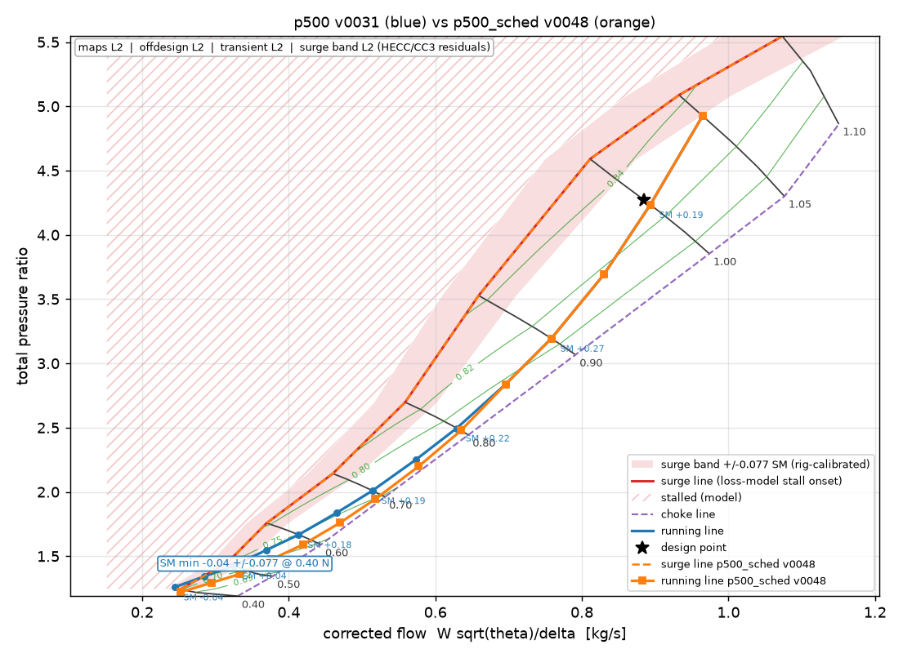

# Compare: p500 v0031  vs  p500_sched v0048

Frozen versions: A -, B -.

## Headline

| quantity | p500 v0031 | p500_sched v0048 | delta |
|---|---|---|---|
| thrust N | 500 | 500 | +0 |
| airflow kg/s | 0.867 | 0.867 | +0.000 |
| OPR | 4.00 | 4.00 | +0.00 |
| T04 K | 1150 | 1150 | +0 |
| TSFC kg/N/h | 0.1192 | 0.1192 | +0.0000 |
| rpm | 72500 | 72500 | +0 |
| D2 mm | 131.4 | 131.4 | +0.0 |
| turbine tip mm | 112.6 | 112.6 | +0.0 |
| OD mm | 183.3 | 183.3 | +0.0 |
| length mm | 350 | 379 | +28 |
| mass kg | 6.44 | 6.66 | +0.22 |
| idle SM | -0.044 | 0.300 | +0.344 |
| SM min (running line) | -0.044 | 0.069 | +0.113 |
| max thrust N | 494 | 494 | -0 |
| slam accel t95 s | 7.25 | 7.10 | -0.15 |
| slam accel SM min | -0.038 | 0.171 | +0.209 |
| start T04 peak K | 1125 | 1200 | +75 |
| hot start T04 peak K | 1200 | 1200 | +0 |
| turbine bore LCF cycles (with thermal) | 43 | 460 | +418 |
| envelope worst SM | -0.046 | -0.046 | -0.000 |

## Inputs that differ

| input | A | B |
|---|---|---|
| inputs.control.bleed_enabled | None | True |
| inputs.control.bleed_max_frac | None | 0.15 |
| inputs.control.igv_enabled | None | True |
| inputs.control.nozzle_A8_low_speed | None | 1.3 |
| inputs.control.nozzle_variable | None | True |
| inputs.control.start_ramp_rate | None | 0.25 |

### Overrides (ingested L3) that differ

| path | A | B |
|---|---|---|
| overrides.life.sigma_bore_total_Pa.at | 2026-09-16T21:25:13 | None |
| overrides.life.sigma_bore_total_Pa.source | CalculiX 2.21 axisymmetric CAX4 disc, 2379 elements, 2026-09-16T18:25:13+00:00; peak taken >= 1 mm from the unfilleted re-entrant corners (singular there) | None |
| overrides.life.sigma_bore_total_Pa.tier | L3 | None |
| overrides.life.sigma_bore_total_Pa.value | 1281428675.674246 | None |
| overrides.mechanical.turbine.sigma_avg_Pa.at | 2026-09-16T21:25:13 | None |
| overrides.mechanical.turbine.sigma_avg_Pa.source | CalculiX 2.21 axisymmetric CAX4 disc, 2379 elements, 2026-09-16T18:25:13+00:00 | None |
| overrides.mechanical.turbine.sigma_avg_Pa.tier | L3 | None |
| overrides.mechanical.turbine.sigma_avg_Pa.value | 398434122.13309824 | None |
| overrides.mechanical.turbine.sigma_peak_Pa.at | 2026-09-16T21:25:13 | None |
| overrides.mechanical.turbine.sigma_peak_Pa.source | CalculiX 2.21 axisymmetric CAX4 disc, 2379 elements, 2026-09-16T18:25:13+00:00 | None |
| overrides.mechanical.turbine.sigma_peak_Pa.tier | L3 | None |
| overrides.mechanical.turbine.sigma_peak_Pa.value | 967096370.3611842 | None |

## Surge margins with their band (SAE SM, absolute)

| rule | A | band A (dominant) | A with band | B | band B (dominant) | B with band | limit |
|---|---|---|---|---|---|---|---|
| MAP-1 | 0.173 | +/-0.077 (rig) | +0.096 FAIL | 0.173 | +/-0.077 (rig) | +0.096 FAIL | 0.150 |
| OD-1 | -0.044 | +/-0.077 (rig) | -0.120 FAIL | 0.069 | +/-0.077 (rig) | -0.008 FAIL | 0.100 |
| OD-4 | -0.044 | +/-0.077 (rig) | -0.120 FAIL | 0.300 | +/-0.159 (igv extrapolation) | +0.141 pass | 0.080 |
| ENV-2 | -0.046 | +/-0.077 (rig) | -0.123 FAIL | -0.046 | +/-0.077 (rig) | -0.123 FAIL | 0.080 |
| TRN-4 | -0.038 | +/-0.082 (rig) | -0.120 FAIL | 0.171 | +/-0.082 (rig) | +0.089 pass | 0.050 |

## Running line

| N/N_d | SM A | SM B | thrust A | thrust B | PR A | PR B | B schedule |
|---|---|---|---|---|---|---|---|
| 0.40 | -0.044 | 0.300 | 31 | 22 | 1.26 | 1.22 | bleed 0.15, igv 25.00 |
| 0.45 | 0.005 | 0.366 | 42 | 29 | 1.34 | 1.29 | bleed 0.15, igv 25.00 |
| 0.50 | 0.043 | 0.412 | 54 | 37 | 1.43 | 1.36 | bleed 0.12, igv 25.00 |
| 0.55 | 0.116 | 0.415 | 70 | 51 | 1.55 | 1.48 | bleed 0.09, igv 20.83 |
| 0.60 | 0.179 | 0.433 | 86 | 65 | 1.67 | 1.59 | bleed 0.07, igv 16.67 |
| 0.65 | 0.190 | 0.453 | 110 | 88 | 1.84 | 1.76 | bleed 0.04, igv 12.50 |
| 0.70 | 0.191 | 0.390 | 134 | 113 | 2.01 | 1.95 | bleed 0.01, igv 8.33 |
| 0.75 | 0.210 | 0.321 | 169 | 151 | 2.25 | 2.20 | bleed 0.00, igv 4.17 |
| 0.80 | 0.217 | 0.237 | 207 | 197 | 2.50 | 2.48 | igv 0.00 |
| 0.85 | 0.254 | 0.254 | 262 | 262 | 2.84 | 2.84 |  |
| 0.90 | 0.271 | 0.271 | 323 | 323 | 3.19 | 3.19 |  |
| 0.95 | 0.242 | 0.242 | 415 | 415 | 3.69 | 3.69 |  |
| 1.00 | 0.194 | 0.194 | 524 | 524 | 4.23 | 4.23 |  |
| 1.05 | 0.069 | 0.069 | 664 | 664 | 4.93 | 4.93 |  |

## Rules that changed

| rule | stage | A value (verdict) | B value (verdict) | margin A -> B | tier |
|---|---|---|---|---|---|
| ASS-1 compressor quality score (mean of items) | assess | 0.851 (pass) | 0.850 (pass) | +13.5% -> +13.3% | L2 |
| C1D-5 lean blow-out margin at idle | combustor1d | 1.209 (warn) | 1.332 (pass) | +0.8% -> +11.0% | L2 |
| CTL-1 bleed fraction at full opening | control | 0.000 (pass) | 0.150 (warn) | +100.0% -> +0.0% | L1 |
| CTL-2 variable nozzle area range A8_low / A8_design | control | 1.000 (pass) | 1.300 (warn) | +25.9% -> +3.7% | L1 |
| CTL-3 IGV pre-swirl range | control | 0.000 (pass) | 25.000 (pass) | +100.0% -> +37.5% | L1 |
| CTL-8 IGV actuation rate required vs capability | control | 0.000 (pass) | 9.375 (pass) | +100.0% -> +68.8% | L1 |
| ENV-1 fraction of envelope grid points cleared (converged, SM >= floor) | envelope | 0.719 (warn) | 0.708 (warn) | -20.1% -> -21.3% | L2 |
| ENV-3 sea-level static max thrust vs design thrust | envelope | 0.987 (warn) | 0.987 (warn) | +3.9% -> +3.9% | L2 |
| GEO-1 dry mass estimate vs limit | geometry | 6.442 (info) | 6.660 (info) | - -> - | L0 |
| GEO-2 thrust/weight (info) | geometry | 7.912 (info) | 7.653 (info) | - -> - | L0 |
| LAY-2 engine length vs limit | layout | 350.297 (info) | 378.661 (info) | - -> - | L0 |
| LIFE-2 turbine disc rim creep life / scatter | life | 17308655.517 (pass) | 17271802.984 (pass) | +34617211.0% -> +34543506.0% | L1 |
| LIFE-4 turbine bore LCF cycles incl. start thermal stress / scatter | life | 14.224 (fail) | 153.498 (fail) | -97.2% -> -69.3% | L1 |
| MECH-5 turbine disc peak stress vs bore allowable | mechanical | 967.096 (fail) | 518.100 (pass) | -53.3% -> +17.9% | L1 |
| MECH-6 turbine disc average stress vs rim creep allowable | mechanical | 398.434 (pass) | 398.539 (pass) | +35.3% -> +35.3% | L1 |
| MECH-7 turbine burst speed ratio | mechanical | 1.267 (pass) | 1.267 (pass) | +5.6% -> +5.6% | L1 |
| OD-1 minimum surge margin along the running line | offdesign | -0.044 (fail) | 0.069 (fail) | -143.9% -> -31.3% | L2 |
| OD-2 max-thrust point recovers the design thrust | offdesign | 0.987 (warn) | 0.987 (warn) | +3.9% -> +3.9% | L2 |
| OD-4 idle surge margin | offdesign | -0.044 (warn) | 0.300 (pass) | -154.9% -> +275.1% | L2 |
| TB-2 max thrust reached on the bench vs design | testbench | 1.046 (pass) | 1.046 (pass) | +10.1% -> +10.2% | L2 |
| TRN-2 start light-off to self-sustain time | transient | 9.900 (warn) | 7.650 (warn) | -23.8% -> +4.4% | L2 |
| TRN-3 slam acceleration idle -> 95 % time | transient | 7.250 (warn) | 7.100 (warn) | -20.8% -> -18.3% | L2 |
| TRN-4 minimum surge margin during the slam acceleration | transient | -0.038 (fail) | 0.171 (pass) | -176.2% -> +242.0% | L2 |
| TRN-10 surge margin with the IGV actuator failed (slam accel, vanes at the failure position) | transient | - | 0.034 (pass) | - -> +3.4% | L2 |

Verdict counts: A {'pass': 115, 'warn': 12, 'info': 10, 'fail': 6}; B {'pass': 118, 'warn': 12, 'info': 10, 'fail': 4}.

