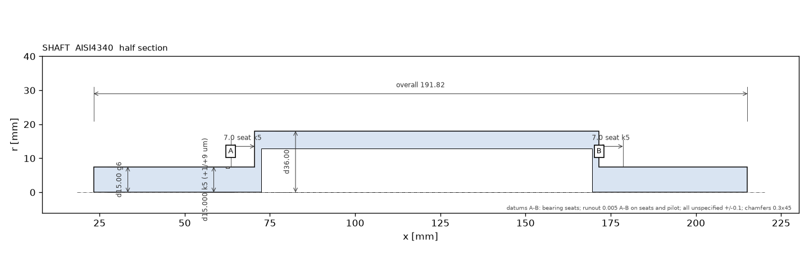
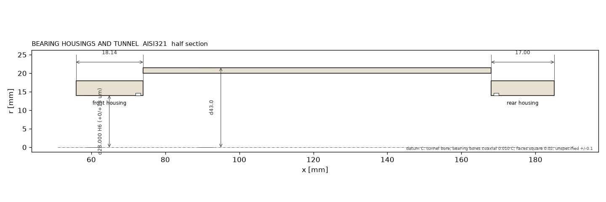
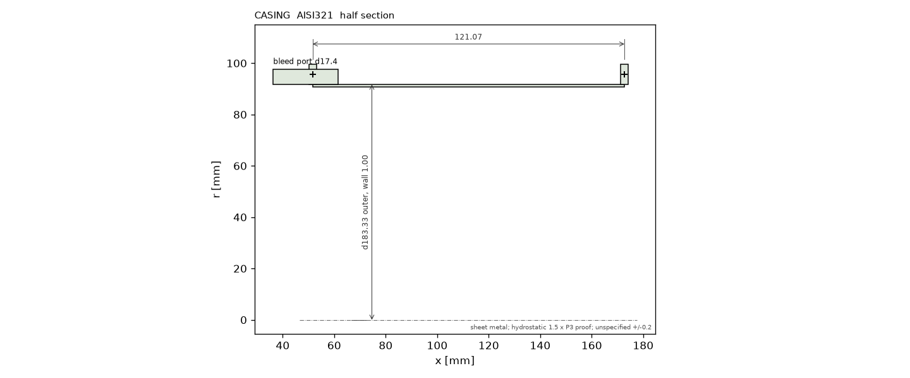

# Manufacturing drawings: p500 v0056

Generated 2026-09-17T06:39:13+00:00 from the geometry sheet.  Fits per ISO 286; deviations in um.

## shaft

| feature | nominal | fit | deviation [um] | note |
|---|---|---|---|---|
| bearing seats (front / rear) | d 15.000 | k5 | +1 / +9 | 71902C-HC inner ring, interference 1..9 um; Ra 0.4; runout 5 um to A-B |
| nose / impeller pilot | d 15.000 | g6 | -17 / -6 | impeller bore slides on; thread for the nut beyond the pilot; Ra 0.8 |
| tube between the bearings | OD 36.00 / ID 25.92 | h11 / drilled | - | not a fit; wall balance-machined, concentric to A-B within 0.02 |
| retaining ring groove | d 14.30 x 1.10 | DIN471-15 | +0 / +60 | DIN 471 groove tolerance H13 |

## housings

| feature | nominal | fit | deviation [um] | note |
|---|---|---|---|---|
| bearing bores (front / rear) | d 28.000 | H6 | +0 / +13 | 71902C-HC outer ring, slight clearance for axial float; Ra 0.8; coaxial 0.010 to the tunnel bore |
| internal retaining ring groove | d 29.40 x 1.30 | DIN472-28 | +0 / +60 | DIN 472 groove H13 |
| o-ring groove | depth 1.40 x width 2.40 | ISO3601-CS1.78 | +0 / +50 | static face seal, groove Ra 1.6 |
| labyrinth seal | 4 teeth, radial clearance 0.10 | running clearance | -20 / +20 | clearance set at assembly against the shaft; tooth tip 0.3 wide |
| tunnel bore | d 40.00 | H7 | +0 / +25 | locates both housings: coaxiality datum C |

## casing

| feature | nominal | fit | deviation [um] | note |
|---|---|---|---|---|
| flange faces | 2 flanges, 3.0 thick, 15 x M2 on the bolt circle | - | - | flatness 0.05; bolt circle position 0.1; faces square to the axis 0.05 |
| shell | d 183.33 x wall 1.00 | rolled / spun sheet | -100 / +100 | roundness 0.2; weld or roll seam ground flush |
| diffuser / turbine shroud pilots | from the housing drawings | H7 / h6 | - | concentricity 0.05 to the bearing tunnel (drives the tip clearance stack, MFG-2) |
